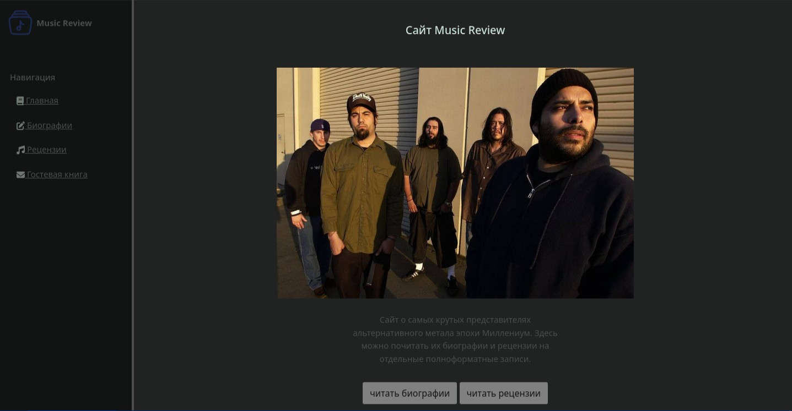
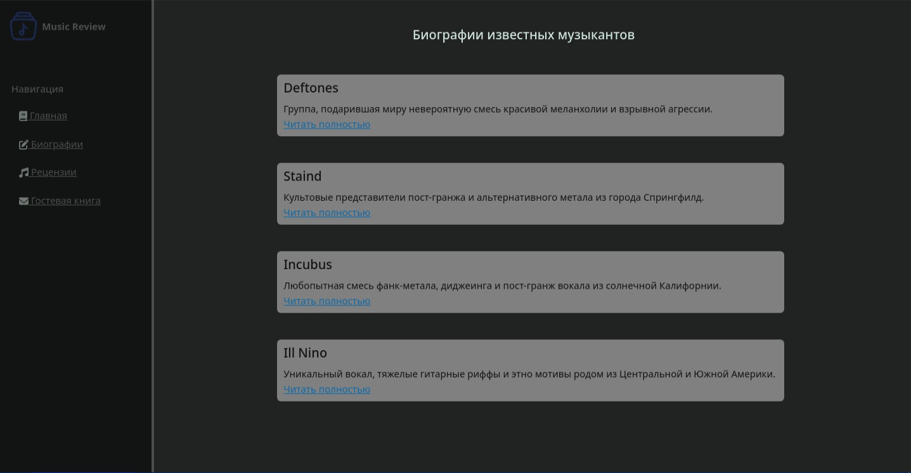
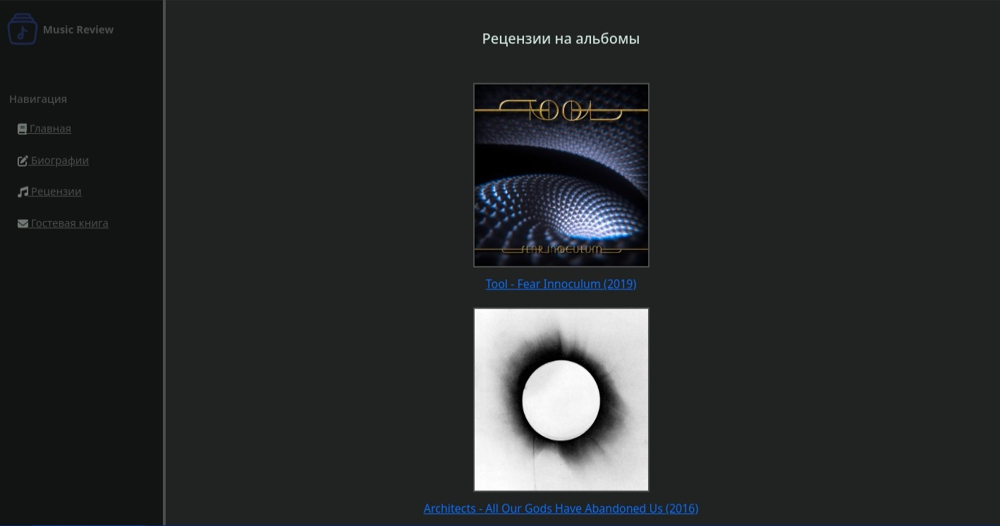
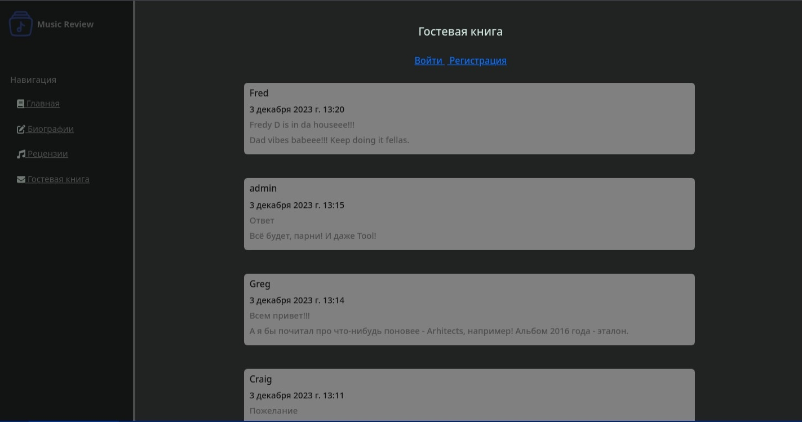

# My first site "Music Review"

This is the first site I've done by Django. It is about music artists and their music albums. In this project I've realized a function of authentication and the guestbook.

 While working on this project, I used Django, SQLite 3, Bootstrap and another technologies.

      

      

      

      

## Developers

- [Ilya Borisov](https://github.com/IamSonic17)